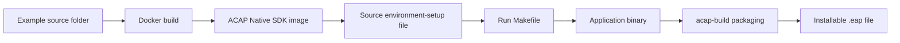
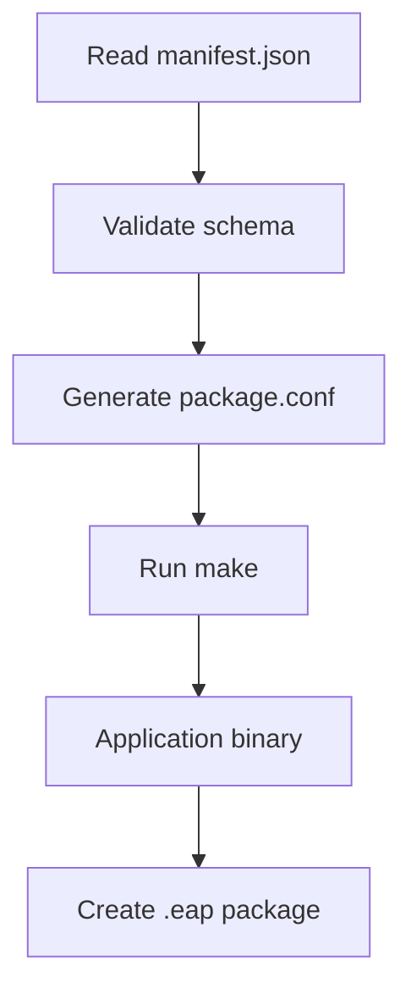

# Axis ACAP Intro

This folder explains the basic structure of an ACAP Native SDK application before introducing any specific Axis API. Read this first if the Dockerfile, Makefile, manifest, or `.eap` package flow is new.

The example in `minimal-app/` is intentionally small. It only starts, logs to syslog, waits for a stop signal, and exits.

## Folder Structure

```text
axis-intro/
`-- minimal-app/
    |-- Dockerfile
    `-- app/
        |-- LICENSE
        |-- Makefile
        |-- axis_intro_minimal.c
        `-- manifest.json
```

Most examples in this repository use the same shape:

| File | Purpose |
| --- | --- |
| `Dockerfile` | Selects the ACAP SDK image and runs the build inside it |
| `app/` | Files copied into `/opt/app/` inside the SDK container |
| `app/Makefile` | Compiles the C source into the application binary |
| `app/manifest.json` | Describes package metadata, permissions, run mode, and compatibility |
| `app/*.c` | Application source code |
| `build/*.eap` | Generated installable ACAP package, after copying it out of the build container |

## Build Flow



## Dockerfile

The minimal app uses this Dockerfile:

```dockerfile
ARG ARCH=aarch64
ARG VERSION=12.10.0
ARG UBUNTU_VERSION=24.04
ARG REPO=axisecp
ARG SDK=acap-native-sdk

FROM ${REPO}/${SDK}:${VERSION}-${ARCH}-ubuntu${UBUNTU_VERSION}

# Building the ACAP application
COPY ./app /opt/app/
WORKDIR /opt/app
RUN . /opt/axis/acapsdk/environment-setup* && acap-build .
```

The `FROM` line pulls the Axis ACAP Native SDK image:

```text
axisecp/acap-native-sdk:12.10.0-aarch64-ubuntu24.04
```

That image contains the cross compiler, target sysroot, headers, libraries, `pkg-config` files, manifest tools, and `acap-build`.

## Build Arguments

| Argument | Example | Meaning |
| --- | --- | --- |
| `ARCH` | `aarch64` | Target camera architecture |
| `VERSION` | `12.10.0` | ACAP SDK version |
| `UBUNTU_VERSION` | `24.04` | Ubuntu base used by the SDK image |
| `REPO` | `axisecp` | Docker repository namespace |
| `SDK` | `acap-native-sdk` | SDK image name |

You can override arguments at build time:

```sh
docker build --tag axis-intro-minimal --build-arg ARCH=aarch64 .
```

## SDK Environment Setup

The important Dockerfile line is:

```dockerfile
RUN . /opt/axis/acapsdk/environment-setup* && acap-build .
```

The leading dot means "source this file into the current shell". That matters because the file exports environment variables used by `make`, `pkg-config`, compilers, and packaging tools.

In the SDK image used by this repository, the file is:

```text
/opt/axis/acapsdk/environment-setup-cortexa53-crypto-poky-linux
```

Interesting parts from the real file:

```sh
export SDKTARGETSYSROOT=/opt/axis/acapsdk/sysroots/aarch64
export PKG_CONFIG_SYSROOT_DIR=$SDKTARGETSYSROOT
export PKG_CONFIG_PATH=$SDKTARGETSYSROOT/usr/lib/pkgconfig:$SDKTARGETSYSROOT/usr/share/pkgconfig
export OECORE_TARGET_ARCH="aarch64"
export OECORE_TARGET_BITS="64"
export CC="aarch64-linux-gnu-gcc ... --sysroot=$SDKTARGETSYSROOT ..."
export CXX="aarch64-linux-gnu-g++ ... --sysroot=$SDKTARGETSYSROOT ..."
export STRIP=aarch64-linux-gnu-strip
export CFLAGS=" -O2 -g  -pipe"
export LDFLAGS="-Wl,-O1 -Wl,--hash-style=gnu -Wl,--as-needed ..."
export ARCH=arm64
export CROSS_COMPILE=aarch64-linux-gnu-
```

That is why the Makefile can use `$(CC)` and `$(STRIP)` without knowing the compiler path. The SDK environment has already set them.

## Makefile

The minimal app Makefile starts by reading the executable name from the manifest:

```make
PROG1 = $(shell jq -r '.acapPackageConf.setup.appName' manifest.json)
```

That means this manifest field:

```json
"appName": "axis_intro_minimal"
```

controls both:

- the binary name built by `make`
- the executable expected by the ACAP package

The compile rule uses SDK-provided variables:

```make
$(PROG1): $(OBJS1)
	$(CC) $(CFLAGS) $(LDFLAGS) $^ $(LDLIBS) -o $@
	$(STRIP) $@
```

`$(CC)` and `$(STRIP)` come from the sourced `environment-setup*` file. If you use libraries such as GLib, Cairo, VDO, or LAROD, the Makefile usually adds `pkg-config`:

```make
PKGS = gio-2.0 glib-2.0 vdostream
CFLAGS += $(shell pkg-config --cflags $(PKGS))
LDLIBS += $(shell pkg-config --libs $(PKGS))
```

`pkg-config` uses `PKG_CONFIG_PATH` from the SDK environment, so it finds target-camera headers and libraries inside the SDK sysroot.

## Manifest

The manifest describes the ACAP package:

```json
{
    "schemaVersion": "2.0.0",
    "acapPackageConf": {
        "setup": {
            "friendlyName": "Axis Intro Minimal App",
            "appName": "axis_intro_minimal",
            "vendor": "Axis Communications",
            "vendorId": "6f16357ced",
            "runMode": "never",
            "version": "1.0.0",
            "compatibleOsVersions": [
                {
                    "max": "13"
                }
            ]
        }
    }
}
```

Important fields:

| Field | Meaning |
| --- | --- |
| `schemaVersion` | Manifest schema used by the SDK build tool |
| `friendlyName` | Name shown in the camera Apps UI |
| `appName` | Name of the executable file |
| `vendor` and `vendorId` | Package owner identity |
| `runMode` | Whether the app starts automatically or manually |
| `version` | Application package version |
| `compatibleOsVersions` | AXIS OS compatibility range |

Some examples add `resources` for permissions:

```json
"resources": {
    "linux": {
        "user": {
            "groups": ["video"]
        }
    }
}
```

That kind of resource is needed for APIs such as VDO. Overlay2 examples use:

```json
"resources": {
    "overlay": {
        "enabled": true,
        "required": true
    }
}
```

## What `acap-build` Does

`acap-build .` runs inside `/opt/app/` and performs the build/package flow:



The `.eap` file is created inside the container under `/opt/app/`.

## Build The Minimal Example

From `axis-intro/minimal-app/`:

```sh
docker build --tag axis-intro-minimal --build-arg ARCH=aarch64 .
docker cp $(docker create axis-intro-minimal):/opt/app ./build
```

The generated `.eap` file will be in:

```text
axis-intro/minimal-app/build/
```

Install that `.eap` file on the camera from the Apps page.

## Runtime Behavior

The minimal C app only logs start and stop messages:

```c
openlog("axis_intro_minimal", LOG_PID, LOG_USER);
syslog(LOG_INFO, "Axis intro minimal app started");
```

It waits until the camera stops the app:

```c
while (running)
    sleep(1);
```

This makes it a good first package because there is no API-specific behavior to debug.

## Where This Fits

Study this folder before `parameter/`, `vapix/`, `event/`, `vdo/`, `overlay/`, or `larod/`.

After this intro, the rest of the repository is easier to read because each example repeats the same basic package structure and then adds one Axis API concept.
