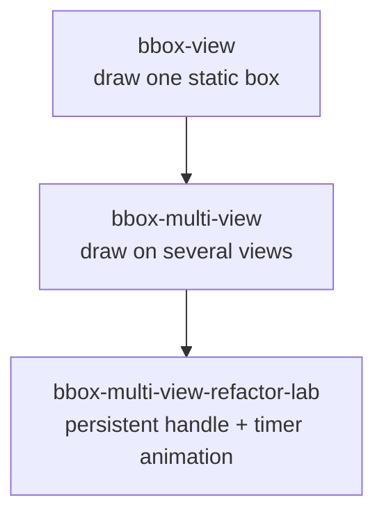
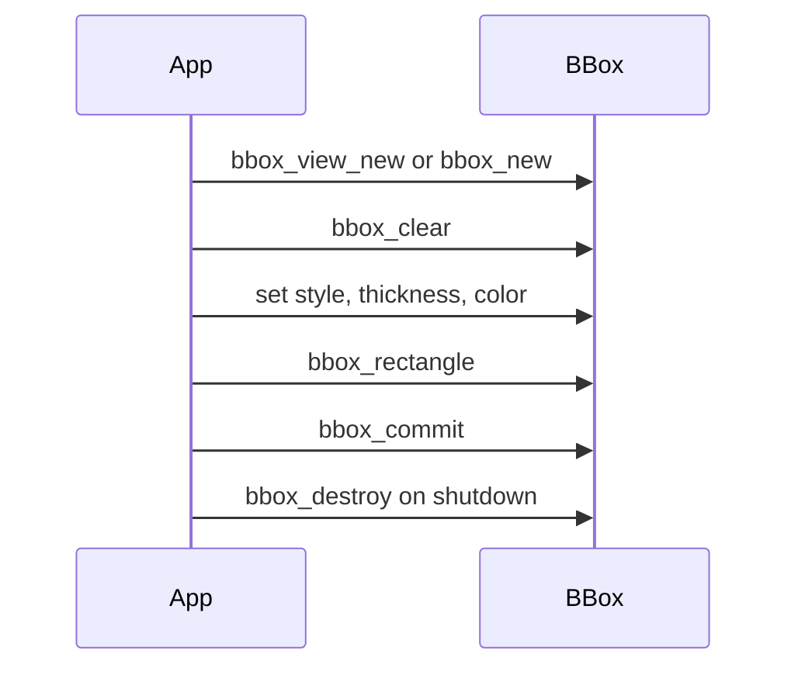
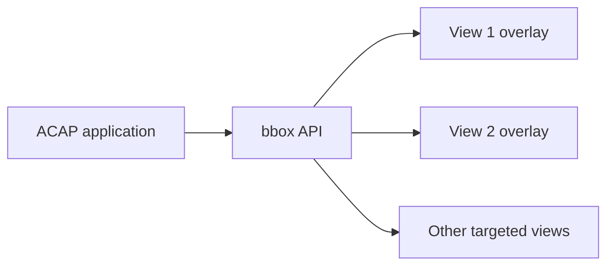

# BBox Examples

`bbox` is the simplest visual feedback API in this workshop. It lets an ACAP
application draw rectangles and related box styles on one or more camera views.

This section belongs early in the visual basics track. It is easier than the
full `overlay/` examples because `bbox` is specialized for box-like graphics.

## Recommended Learning Order



## Example Summary

| Example | Main lesson | Adds |
| --- | --- | --- |
| `bbox-view` | Draw one box on one view | `bbox_view_new`, style, commit, cleanup |
| `bbox-multi-view` | Draw on multiple views | `bbox_new`, several view ids, animation |
| `bbox-multi-view-refactor-lab` | Structure a smoother bbox app | persistent bbox handle, GLib timer, clean shutdown |

## Core Flow



## Core Concepts

### Handle

A `bbox_t*` is the drawing context. It can target one view or several views.

```c
bbox_t* bbox = bbox_view_new(1u);
```

or:

```c
bbox_t* bbox = bbox_new(4u, 1u, 2u, 3u, 4u);
```

### Draw Queue

Drawing calls queue geometry. Nothing appears until commit:

```c
bbox_clear(bbox);
bbox_rectangle(bbox, x1, y1, x2, y2);
bbox_commit(bbox, 0u);
```

### Style

```c
bbox_style_outline(bbox);
bbox_thickness_thin(bbox);
bbox_color(bbox, bbox_color_from_rgb(0xff, 0x00, 0x00));
```

### Coordinates

Many examples use normalized coordinates:

```text
x = 0.0 left, 1.0 right
y = 0.0 top,  1.0 bottom
```

If normalized mode is needed, enable it explicitly:

```c
bbox_coordinates_frame_normalized(bbox);
```

## Runtime Architecture



## Build Pattern

Run the build command from each example folder:

```bash
docker build --tag EXAMPLE_NAME --build-arg ARCH=aarch64 .
docker cp $(docker create EXAMPLE_NAME):/opt/app ./build
```

## Teaching Notes

- `bbox` is specialized and simple. Use it for box overlays.
- `bbox_commit` is the point where queued drawing becomes visible.
- Clear before redrawing animated boxes.
- Prefer creating a persistent handle once for repeated drawing.
- Always clear overlays on shutdown.

## Exercises

1. Change box color and thickness.
2. Draw two rectangles before one `bbox_commit`.
3. Switch between pixel and normalized coordinates.
4. Target a different view id.
5. Compare recreating the handle every frame with reusing one handle.
