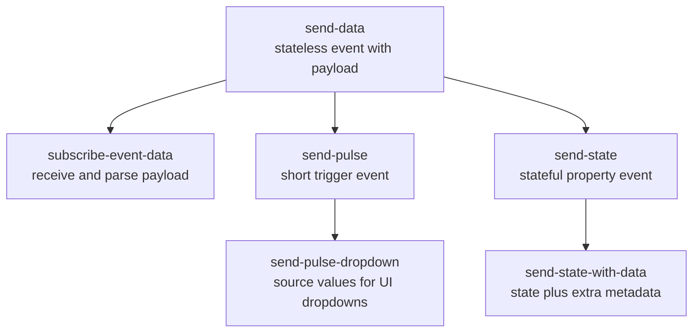
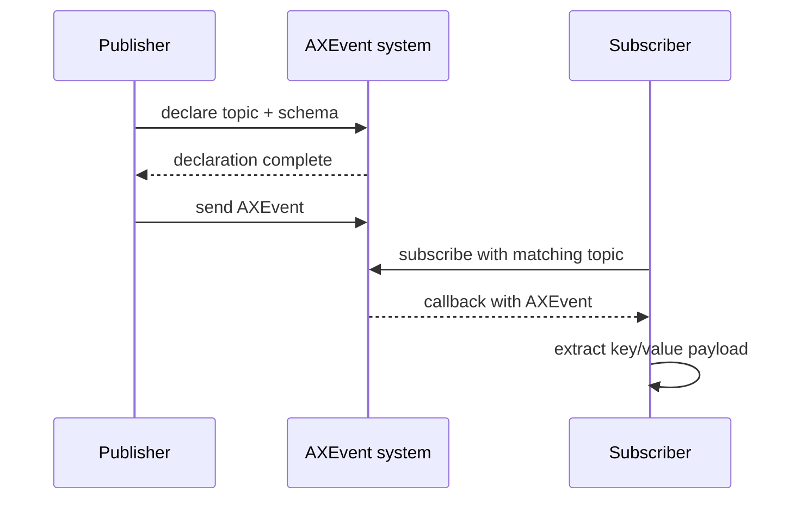

# Event Examples

The Event API is a core ACAP concept. It lets an application publish events that
other applications, action rules, or clients can subscribe to.

This folder teaches event publishing first, then event subscription.

## Recommended Learning Order



## Example Summary

| Example | Main lesson |
| --- | --- |
| `send-data` | declare and send stateless data events |
| `subscribe-event-data` | subscribe to a topic and extract payload |
| `send-pulse` | send short trigger-like events |
| `send-pulse-dropdown` | mark values as source fields for dropdown behavior |
| `send-state` | declare a stateful event with an active property |
| `send-state-with-data` | combine state with additional data fields |

## Core Event Flow



## Topics

Events are organized by topic keys:

```c
ax_event_key_value_set_add_key_value(kv,
                                     "topic0",
                                     "tnsaxis",
                                     "CameraApplicationPlatform",
                                     AX_VALUE_TYPE_STRING,
                                     NULL);
```

Most examples use:

```text
topic0 = tnsaxis:CameraApplicationPlatform
topic1 = tnsaxis:<ExampleGroup>
topic2 = tnsaxis:<ExampleEvent>
```

The subscriber must use matching topic values.

## Data vs Source

Data values are event payload:

```c
ax_event_key_value_set_mark_as_data(kv, "Temperature", NULL, NULL);
```

Source values describe selectable event sources, often visible as dropdowns:

```c
ax_event_key_value_set_mark_as_source(kv, "value", NULL, NULL);
```

## Stateless vs Stateful

When declaring an event, the state flag controls event semantics:

```c
ax_event_handler_declare(handler, kv, 1, &declaration, callback, data, NULL);
```

```text
1 = stateless event
0 = stateful/property event
```

Stateful events represent a current condition. Stateless events represent an
occurrence or data sample.

## Build Pattern

Run from each example folder:

```bash
docker build --tag EXAMPLE_NAME --build-arg ARCH=aarch64 .
docker cp $(docker create EXAMPLE_NAME):/opt/app ./build
```

## Teaching Notes

- Declare before sending.
- Keep topic names stable; subscribers depend on exact matches.
- Use data fields for values consumers should read.
- Use source fields when event configuration should expose selectable choices.
- Keep the GLib main loop running so timers and callbacks execute.

## Exercises

1. Change `topic1` in a sender and observe that the subscriber stops receiving.
2. Add a new data field to `send-data` and parse it in the subscriber.
3. Change a stateless event to stateful and inspect behavior in the camera UI.
4. Add more dropdown values to `send-pulse-dropdown`.
