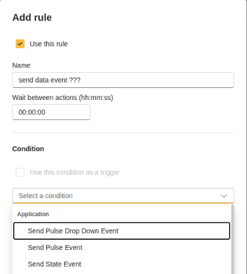
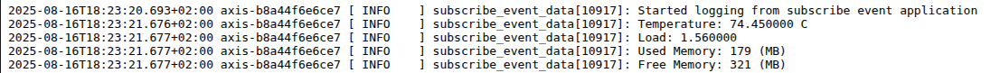

# Test Send Data

Use this guide after building, installing, and starting the `send_data` app.

## What to test

The app should declare `CameraApplicationPlatform/SendData/SendDataEvent` and send data values for temperature, load, used memory, and free memory.

## Check event visibility

The event is marked as application data and may not be shown as a normal action-rule event.

## Inspect the event declaration

Use the sample event declaration as a reference:

[send-data.xml](./send-data.xml)

## Test with the subscriber

1. Install and start `send_data`.
2. Install and start `subscribe_event_data`.
3. Check the subscriber application logs.
4. Confirm that the logs contain temperature, load, used memory, and free memory values.

