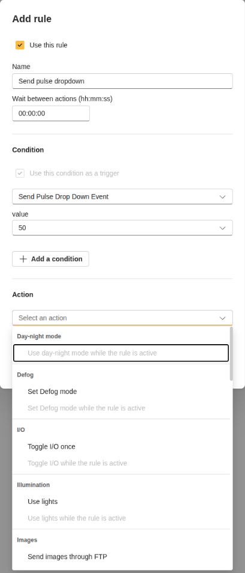
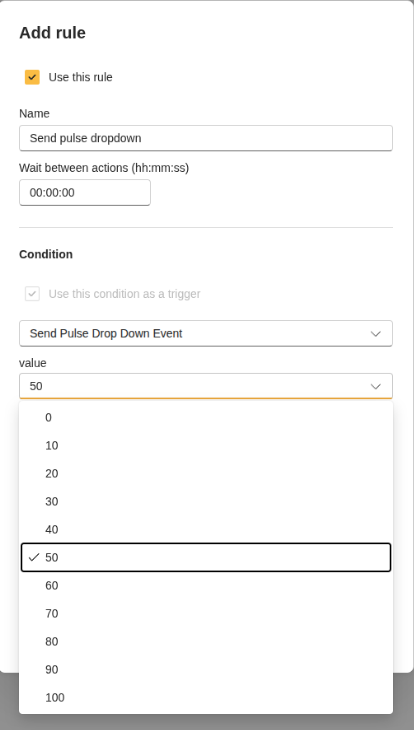
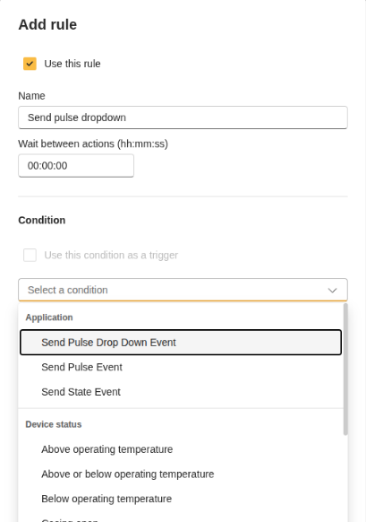

# Test Send Pulse Dropdown

Use this guide after building, installing, and starting the `send_pulse_drop_down` app.

## What to test

The app should declare stateless pulse events where `value` is a source field. The camera UI should show selectable values.

## Test from the camera UI

1. Open the camera app page and start `Send Pulse Drop down`.
2. Open the event or action-rule UI.
3. Confirm that the event is available as a stateless action source.

4. Confirm that the `value` field appears as a dropdown.

5. Confirm that pulse events are listed for the dropdown source values.

