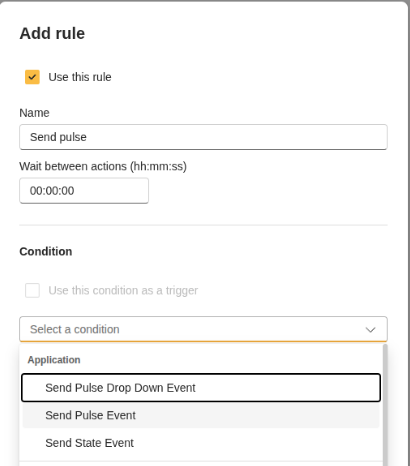
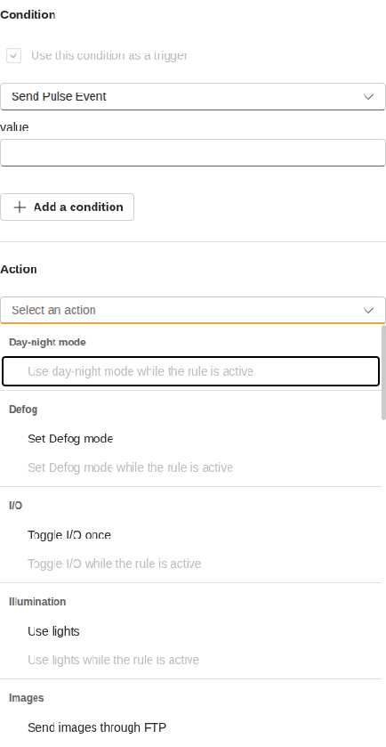

# Test Send Pulse

Use this guide after building, installing, and starting the `send_pulse` app.

## What to test

The app should declare a stateless event and send a pulse value every five seconds.

## Test from the camera UI

1. Open the camera app page and start `Send Pulse`.
2. Open the event or action-rule UI.
3. Confirm that the stateless event is listed.

4. Use the event in an action rule and confirm that it can trigger an action.

## Check logs

Open the app logs and confirm that event sending repeats while the app is running.
