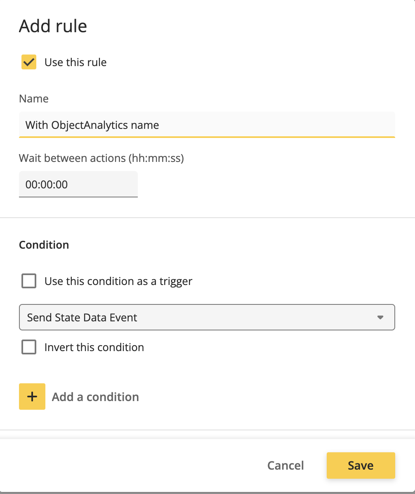
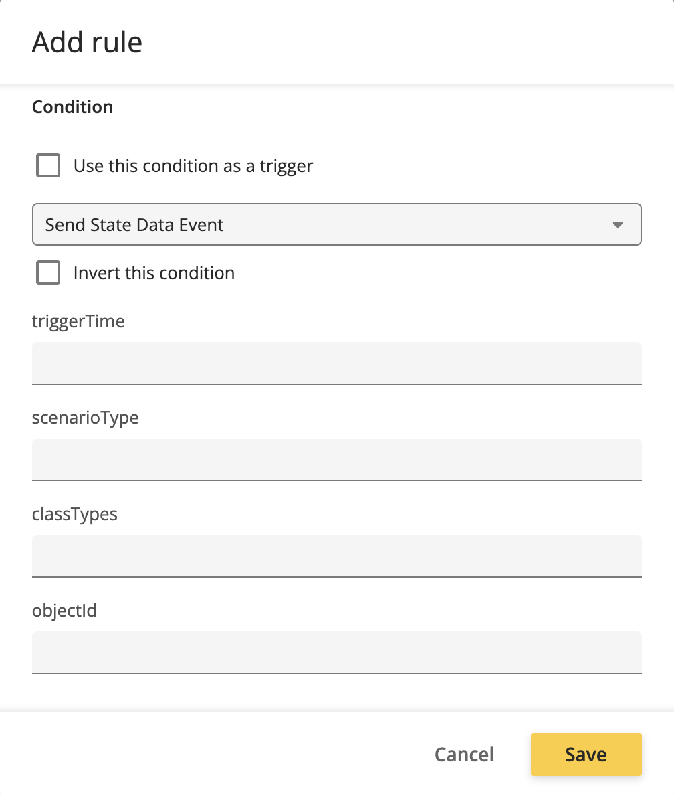

# Test Send State With Data

Use this guide after building, installing, and starting the `send_state_with_data` app.

## What to test

The app should declare a stateful Object Analytics style event with `active` as the state key and additional metadata fields.

## Check UI behavior

The `ObjectAnalytics` topic affects whether the event appears in the normal UI event list.



Compare with:



## Inspect the event list

The helper script and sample XML are available in:

```text
.test/python-env/
```

Use them to inspect the ONVIF event list and confirm that `active`, `triggerTime`, `classTypes`, `scenarioType`, and `objectId` are declared as data fields.
