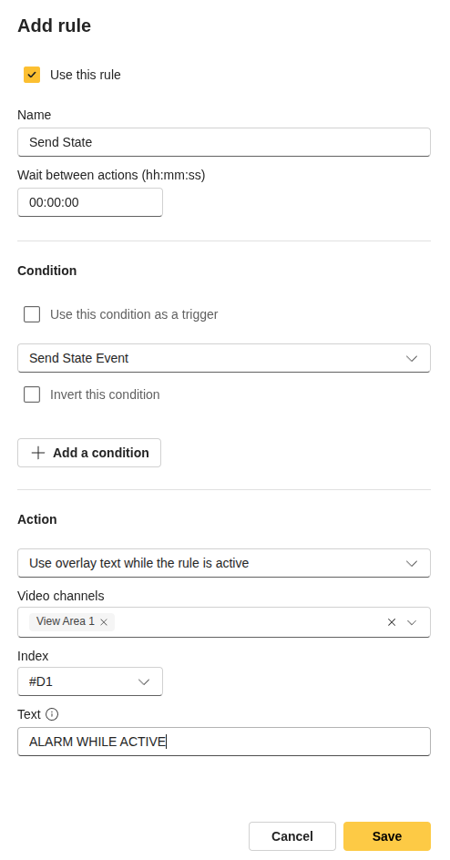
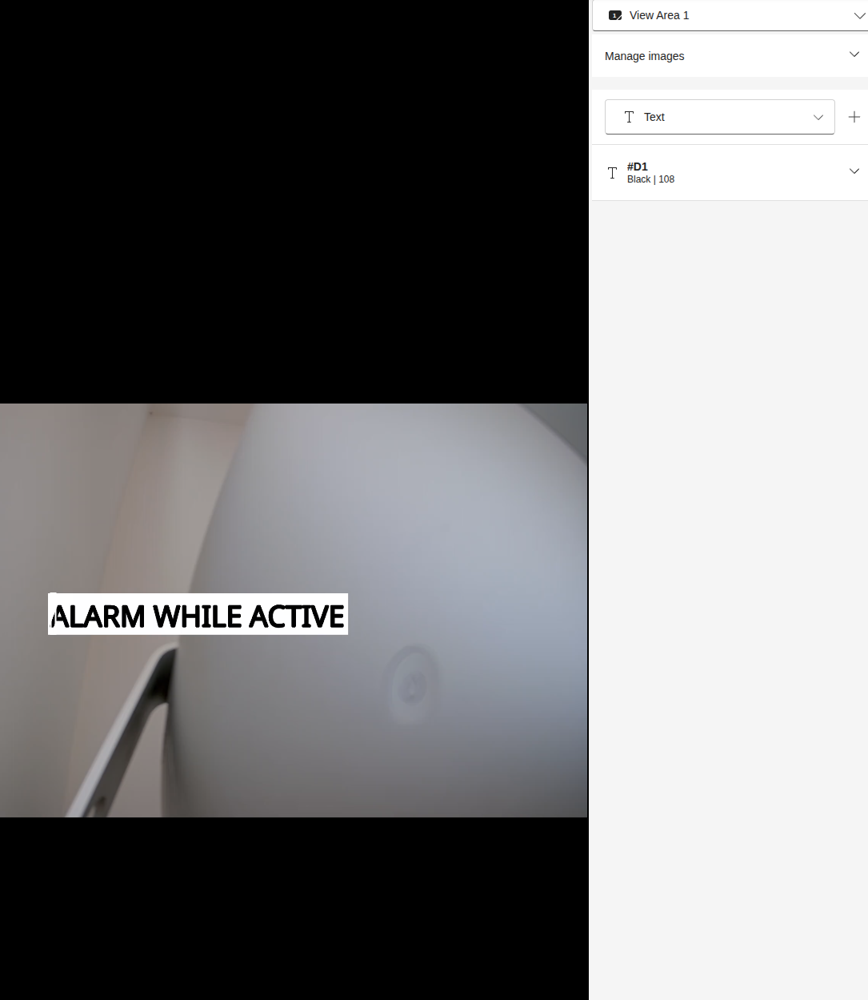

# Test Send State

Use this guide after building, installing, and starting the `send_state` app.

## What to test

The app should declare a stateful event with an `active` property that toggles every five seconds.

## Test from the camera UI

1. Open the camera app page and start `Send State`.
2. Open the event or action-rule UI.
3. Confirm that the state event is visible.

4. Use the state event in an action rule, for example to control an overlay.

## Check logs

Open the app logs and confirm that event sending repeats while the app is running.
