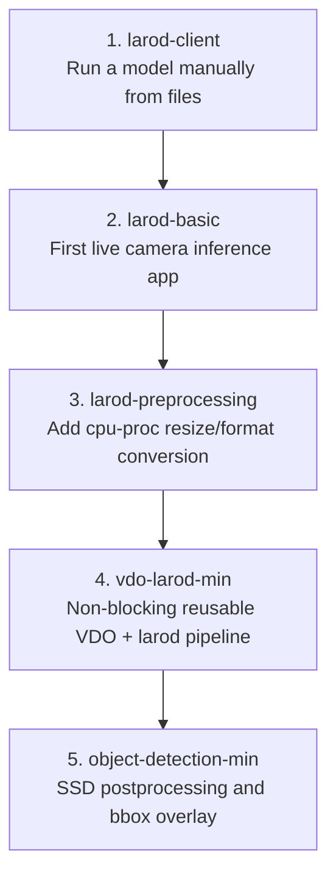
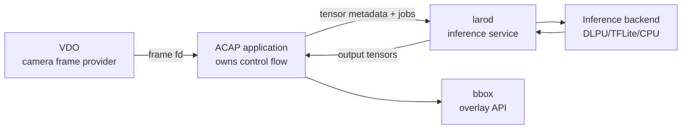
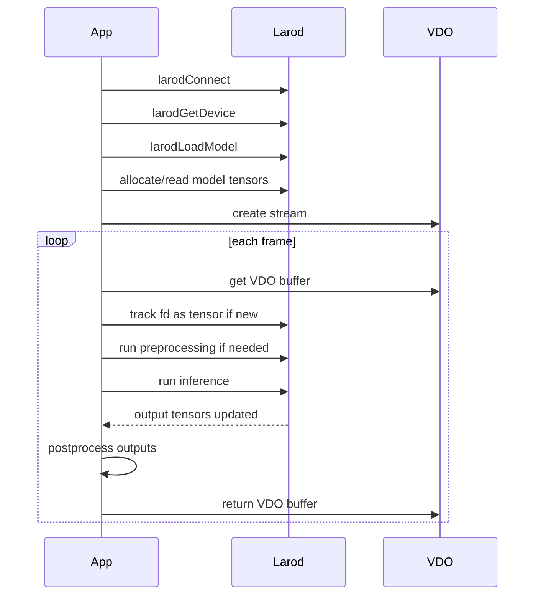
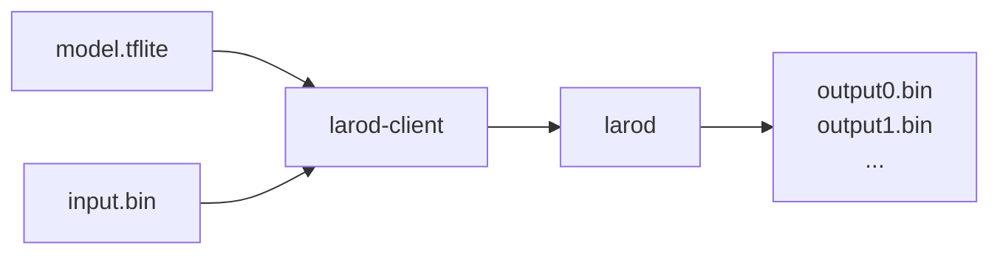
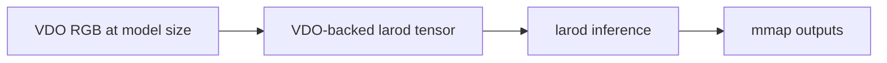
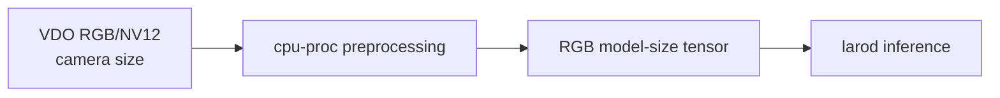
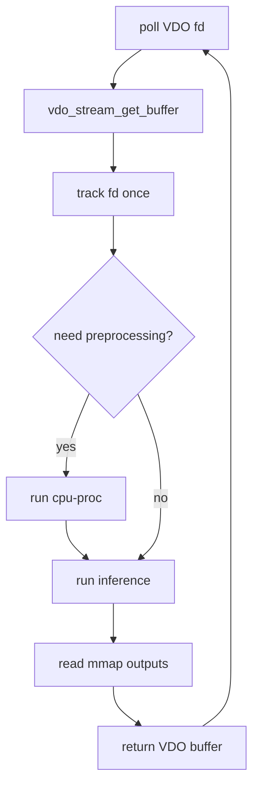
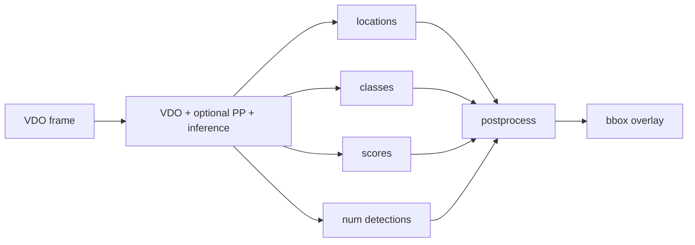
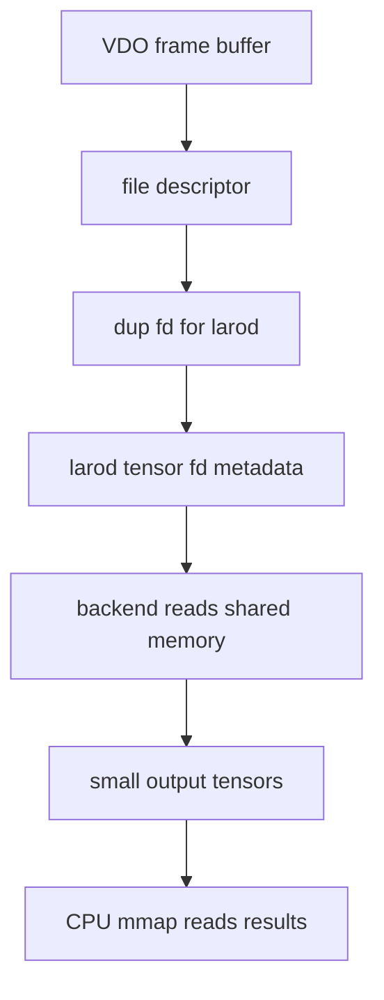

# larod Examples

This folder is a progressive set of examples for learning larod on Axis cameras.
The intention is to start with the smallest possible mental model, then add one
new piece at a time until the full camera-to-object-detection pipeline is clear.

`larod` is the Axis local inference service. Applications use it to load models,
select inference backends, allocate tensors, track shared memory buffers, and run
inference jobs.

## Recommended Learning Order



This order is important. Each example keeps previous concepts and adds a new
layer.

## Folder Summary

| Folder | Main lesson | Adds |
| --- | --- | --- |
| `larod-client` | Run larod manually with model/input/output files | model validation, raw tensor files, SSD output inspection |
| `larod-basic` | Minimal live camera inference app | VDO frames, direct RGB input, DMA-BUF tensor tracking |
| `larod-preprocessing` | Add preprocessing | `cpu-proc`, image format conversion, resize to model input |
| `vdo-larod-min` | Production-shaped minimal pipeline | non-blocking VDO, `poll`, backend-aware RGB/NV12 path |
| `object-detection-min` | Object detection overlay | four SSD outputs, confidence filtering, `bbox` rectangles |

## Core Concepts



VDO and larod do different jobs:

- VDO provides camera frames.
- larod runs models and preprocessing jobs.
- The application connects the two by describing VDO buffers as larod tensors.
- bbox draws results back into the camera view.

## What larod Owns

larod owns:

- loaded model handles
- allocated input/output tensors when requested
- job requests
- execution on a selected backend
- tracking metadata for external fd-backed tensors

larod does not own:

- the camera stream
- the VDO frame lifecycle
- application control flow
- model-specific postprocessing
- bbox overlays

## The Standard larod Pattern

Every larod application in this folder follows the same high-level structure:



## Progressive Complexity

### 1. larod-client

Start without camera frames. Use a model file and a prepared binary input file.



This teaches:

- the backend must be correct
- the input tensor bytes must match the model
- output tensors need decoding
- SSD models often have multiple outputs

### 2. larod-basic

Add live camera frames, but keep the path direct:



This teaches:

- VDO stream setup
- model input metadata
- manual input tensor descriptors
- DMA-BUF fd tracking
- output tensor mmap

Constraint: VDO must produce RGB at exactly the model size.

### 3. larod-preprocessing

Add conversion and resizing:



This teaches:

- preprocessing is a larod model
- `cpu-proc` is configured with `larodMap`
- fd `-1` means no model file for preprocessing
- preprocessing output tensors can become inference input tensors

### 4. vdo-larod-min

Make the loop more realistic:



This teaches:

- non-blocking streams
- backend capability decisions
- reusable setup helpers
- production-style frame loop structure

### 5. object-detection-min

Replace the two-output classifier with an SSD object detector:



This teaches:

- model-specific output parsing
- normalized detection box coordinates
- confidence thresholds
- drawing with bbox

## Memory Model

The key performance concept is avoiding full-frame CPU copies.



The large image frame is shared by fd. The CPU reads only small output tensors.

## Common API Roles

| API | Role |
| --- | --- |
| `larodConnect` | open session with larod |
| `larodGetDevice` | choose backend |
| `larodLoadModel` | load inference model or cpu-proc preprocessing pipeline |
| `larodAllocModelInputs` | inspect model input metadata |
| `larodAllocModelOutputs` | allocate backend-written output tensors |
| `larodCreateTensors` | create manual tensor descriptors for external memory |
| `larodTrackTensor` | register fd-backed memory with larod |
| `larodCreateJobRequest` | bind model, inputs, outputs |
| `larodRunJob` | execute preprocessing or inference |

## Build Instructions

Each example is built from its own folder with Docker. The common pattern is:

```bash
docker build --tag IMAGE_NAME --build-arg ARCH=aarch64 .
docker cp $(docker create IMAGE_NAME):/opt/app ./build
```

Run the commands from the example folder, not from `larod/`.

| Example | Build command |
| --- | --- |
| `larod-client` | `docker build --tag larod-client --build-arg ARCH=aarch64 .` |
| `larod-basic` | `docker build --tag larod-basic --build-arg ARCH=aarch64 .` |
| `larod-preprocessing` | `docker build --tag larod-preprocessing --build-arg ARCH=aarch64 .` |
| `vdo-larod-min` ARTPEC-9 | `docker build --tag vdo-larod-min --build-arg ARCH=aarch64 --build-arg CHIP=artpec9 .` |
| `vdo-larod-min` ARTPEC-8 | `docker build --tag vdo-larod-min --build-arg ARCH=aarch64 --build-arg CHIP=artpec8 .` |
| `object-detection-min` | `docker build --tag object-detection-min --build-arg ARCH=aarch64 .` |

After building, copy the package out:

```bash
docker cp $(docker create IMAGE_NAME):/opt/app ./build
```

The generated `.eap` package will be under the copied `build` directory.

## Is This Good Teaching Content For Newcomers?

Yes, with one caveat: newcomers need the progression to be explicit. larod has
several concepts that look similar at first:

- model input tensors vs manually created VDO tensors
- preprocessing model vs inference model
- VDO buffers vs larod tensors
- output tensors vs postprocessed results

The examples are good for teaching if they are used in this order and each class
session focuses on one new idea:

1. Run a model from files.
2. Replace the input file with a live VDO frame.
3. Add preprocessing when the frame does not match.
4. Make the frame loop non-blocking and reusable.
5. Add model-specific postprocessing and overlays.

For a class, avoid starting with `object-detection-min`. It has all concepts at
once. Start with `larod-client` or `larod-basic`, then build up.

## Suggested Class Exercises

1. Change `DEVICE_NAME` and observe backend errors.
2. Print the model input dimensions and compare them to VDO stream dimensions.
3. Change VDO resolution and force preprocessing.
4. Log when a VDO fd is tracked and show that tracking happens once per buffer.
5. Raise/lower confidence thresholds in object detection.
6. Replace the model and identify which postprocessing assumptions break.
