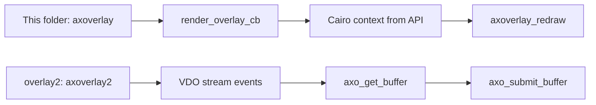
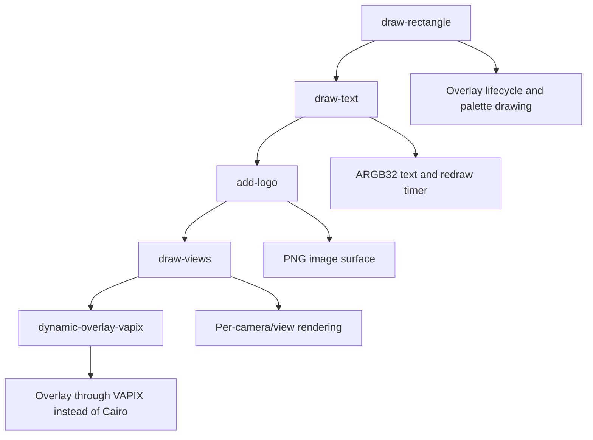
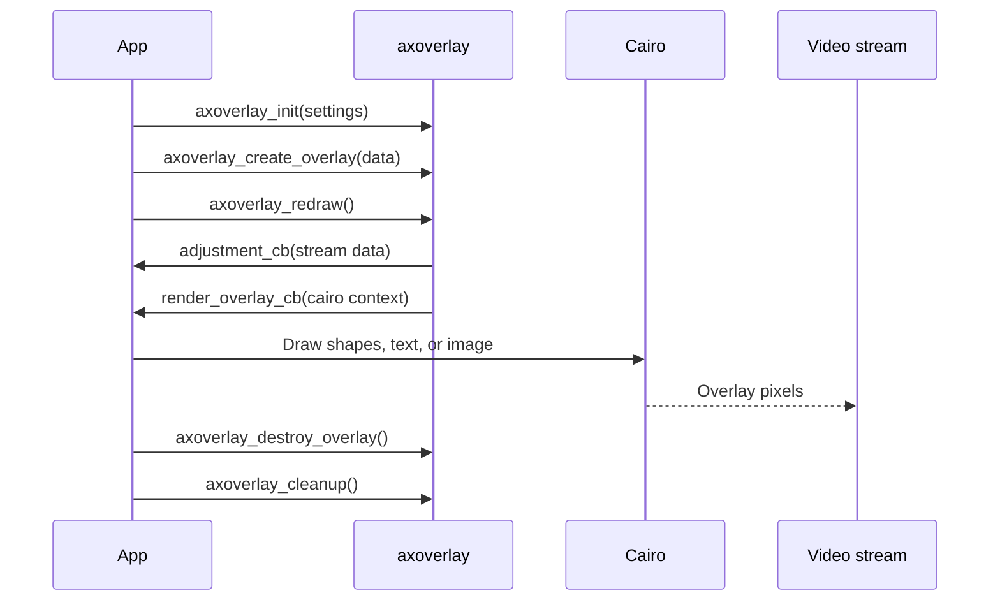
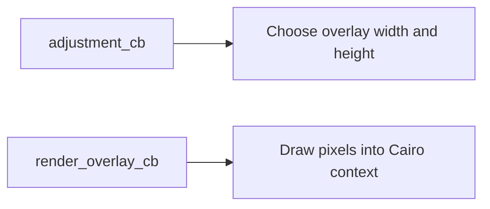

# Overlay Examples

Overlay is the advanced visual track. These examples draw graphics on top of the video stream, either directly with `axoverlay` and Cairo or indirectly through the Dynamic Overlay VAPIX API.

Study `bbox/` before this section. Bounding boxes teach the simplest visual annotation model. Overlay adds lower-level drawing control, stream adjustment callbacks, color spaces, image assets, text, and per-view behavior.

After this folder, study `../overlay2/` to see the newer `axoverlay2` API. The new API uses VDO stream events and explicit overlay buffer submission instead of the callback model shown here.

## Difference From overlay2



Use this folder to teach overlay drawing concepts first. Use `../vdo/vdo-stream-events/` and then `../overlay2/` to teach the newer stream-event and buffer-submission model.

## Learning Order



## Examples

| Example | Main idea | What to study |
| --- | --- | --- |
| `draw-rectangle` | Minimal Cairo drawing on video | `axoverlay_init`, palette colors, render callback |
| `draw-text` | Dynamic text overlay | ARGB32, font cache, timer redraw |
| `add-logo` | Draw a PNG logo | Cairo image surfaces, normalized positioning |
| `draw-views` | Different graphics for different cameras/views | `stream->camera`, normalized shapes |
| `dynamic-overlay-vapix` | Create overlay through camera API | VAPIX credentials, JSON request, response identity |

## axoverlay Lifecycle



## Shared Setup Pattern

Most examples configure the Cairo backend:

```c
struct axoverlay_settings settings;
axoverlay_init_axoverlay_settings(&settings);
settings.render_callback = render_overlay_cb;
settings.adjustment_callback = adjustment_cb;
settings.backend = AXOVERLAY_CAIRO_IMAGE_BACKEND;
axoverlay_init(&settings, &error);
```

Then they create an overlay sized for the stream:

```c
struct axoverlay_overlay_data data;
axoverlay_init_overlay_data(&data);
data.postype = AXOVERLAY_CUSTOM_NORMALIZED;
data.anchor_point = AXOVERLAY_ANCHOR_CENTER;
data.width = camera_width;
data.height = camera_height;
overlay_id = axoverlay_create_overlay(&data, NULL, &error);
```

## Adjustment Versus Render



`adjustment_cb` reacts to stream size and rotation. `render_overlay_cb` performs the actual drawing.

## Build Pattern

From each example directory:

```sh
docker build --tag example-name --build-arg ARCH=aarch64 .
docker cp $(docker create example-name):/opt/app ./build
```

## Teaching Notes

Overlay is advanced because it sits directly on the video presentation path. The student should understand:

- Overlay dimensions can change with stream resolution and rotation.
- Palette color spaces are efficient but limited.
- ARGB32 is flexible for text and images but uses more memory.
- `axoverlay_redraw()` requests rendering; drawing happens in the render callback.
- Dynamic Overlay VAPIX is a higher-level alternative when direct Cairo drawing is not needed.
