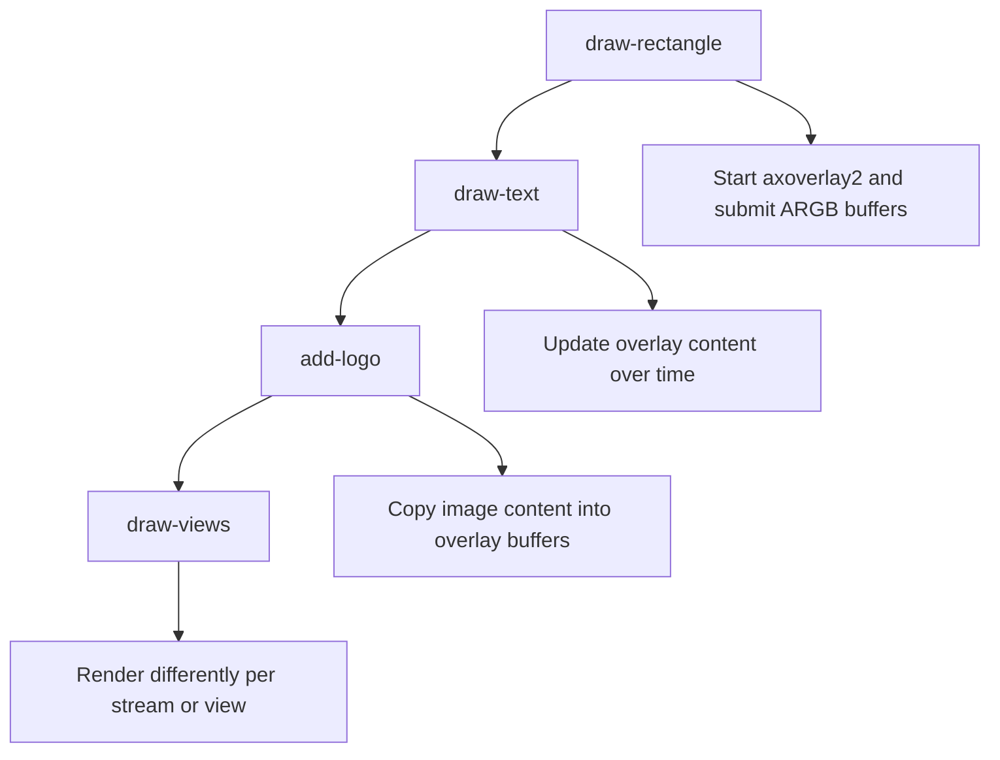
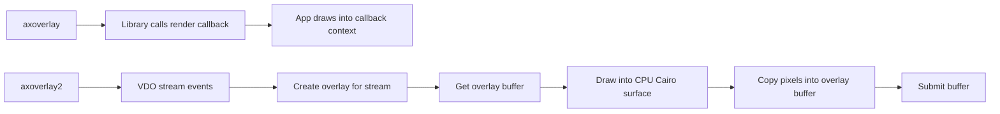
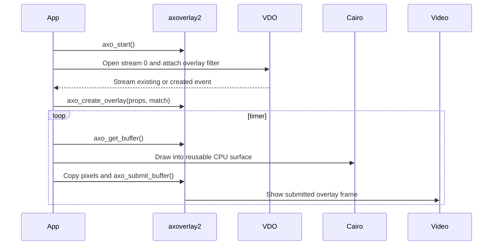

# Overlay2 Examples

`overlay2/` teaches the newer ACAP overlay API, exposed through `axoverlay2.h`. It is intentionally separate from `overlay/` because the programming model is different.

The old `axoverlay` examples register render and adjustment callbacks. The new `axoverlay2` examples listen to VDO stream events, create overlays that match streams, get writable overlay buffers, render pixels, and submit those buffers.

Study `../vdo/vdo-stream-events/` before this folder if VDO stream events are new. That example teaches the stream discovery part without any overlay code.

## Learning Order



## Overlay Versus Overlay2



## API Difference In Practice

| Topic | `axoverlay` | `axoverlay2` |
| --- | --- | --- |
| Main model | Callback rendering | Explicit buffer submission |
| Stream discovery | Overlay callback receives stream data | App listens to VDO stream events |
| Create target | `axoverlay_create_overlay()` | `axo_create_overlay()` with `axo_match_stream_id()` |
| Draw trigger | `axoverlay_redraw()` | Timer, event, or app logic calls `axo_get_buffer()` |
| Drawing destination | Cairo context provided by API | App-owned Cairo surface copied into `axo_buffer` |
| Submit step | Hidden by callback model | Explicit `axo_submit_buffer()` |
| Best first lesson | Drawing with callbacks | Stream lifecycle and buffer ownership |

The practical consequence is that `overlay2` examples contain more VDO code. That is not accidental. Stream lifecycle is part of the new API mental model.

## Examples

| Example | Main idea | What to study |
| --- | --- | --- |
| `draw-rectangle` | Minimal `axoverlay2` overlay | VDO stream events, aligned buffer size, buffer submit |
| `draw-text` | Dynamic text | Timer-driven updates, font rendering, ARGB32 pixels |
| `add-logo` | PNG logo | Cairo image surface, scaling, packaged asset path |
| `draw-views` | Per-stream drawing | Stream metadata, different rendering per view |

## Core Code Flow



## Why The Intermediate Cairo Surface Exists

The overlay buffer returned by `axo_get_buffer()` may be device memory. CPU drawing libraries such as Cairo are not always safe or efficient when drawing directly into that memory. These examples draw into a normal Cairo image surface first:

```c
cairo_surface_t* surface =
    cairo_image_surface_create(CAIRO_FORMAT_ARGB32, full_width, full_height);
```

Then they copy the final pixels into the overlay buffer:

```c
memcpy(target_buffer, cairo_image_surface_get_data(overlay->surface), byte_size);
```

This mirrors the GitHub `axoverlay2` sample model and keeps the memory ownership explicit.

## Build Pattern

From each example directory:

```sh
docker build --tag example-name --build-arg ARCH=aarch64 .
docker cp $(docker create example-name):/opt/app ./build
```

These examples require an ACAP SDK and Axis OS version that provide `axoverlay2.h`, `libaxoverlay2`, and VDO stream support.

## Teaching Notes

Use `overlay2/` after `overlay/`. The student should first understand Cairo drawing and overlay concepts, then learn what changes in the new API:

- Stream lifecycle comes from VDO events.
- The application owns a table of overlays per stream.
- Overlay size must be aligned with `axo_get_aligned_size()`.
- Rendering is an explicit buffer acquisition and submit cycle.
- `AXO_ERR_NO_STREAM` and `AXO_ERR_WAIT` are normal runtime conditions that must be handled.
