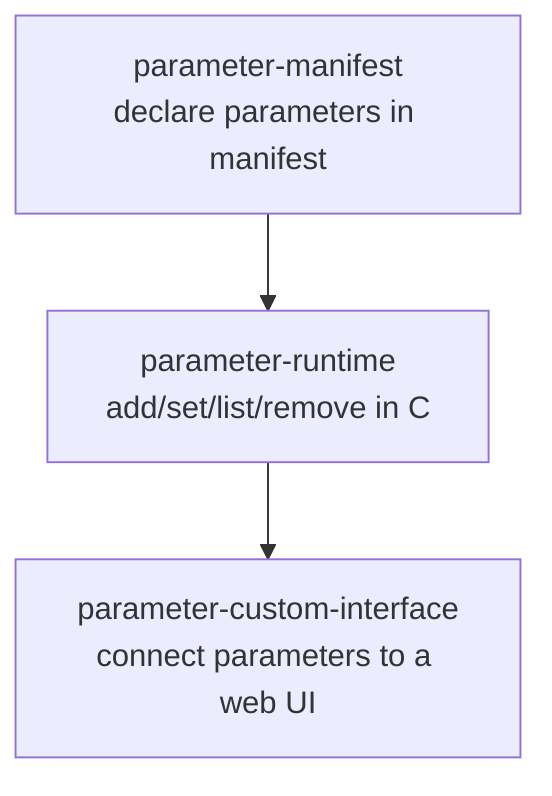
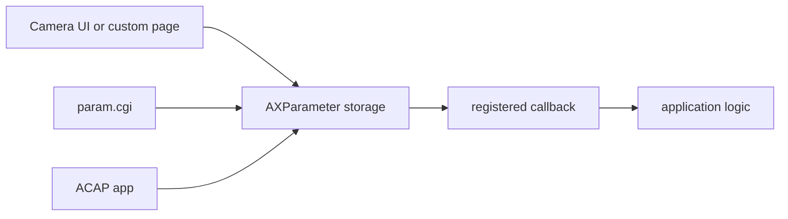
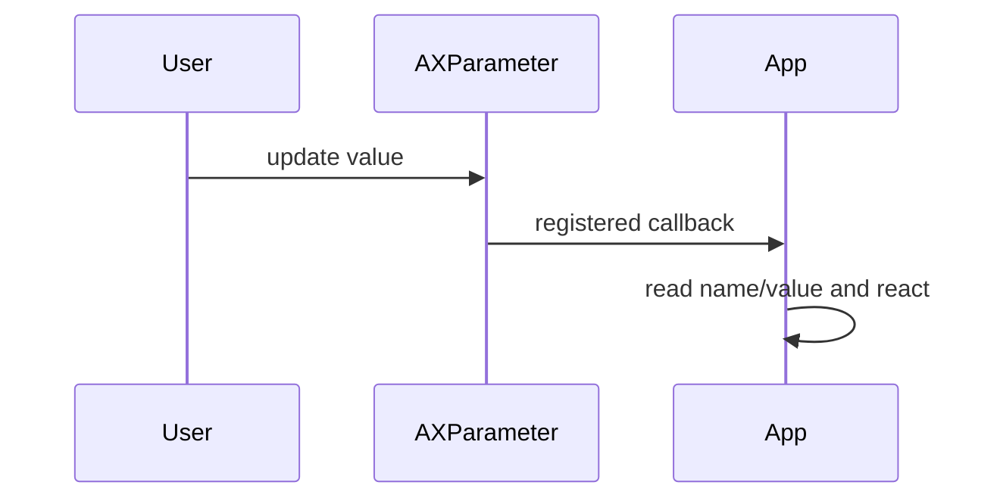

# Parameter Examples

The Parameter API is a core ACAP concept. Parameters let an application expose
persistent configuration values that can be changed from code, VAPIX, the camera
UI, or a custom web page.

This folder belongs in the basic track of the workshop.

## Recommended Learning Order



## Example Summary

| Example | Main lesson | Adds |
| --- | --- | --- |
| `parameter-manifest` | Parameters declared in `manifest.json` | callbacks and GLib main loop |
| `parameter-runtime` | Parameters created by C code | add, set, list, remove |
| `parameter-custom-interface` | Parameters controlled from a web UI | `param.cgi`, callbacks, deferred writes |

## Core Concept



Parameters are stored under the app scope:

```text
root.<app_name>.<parameter_name>
```

Example:

```text
root.parameter_runtime.ParameterRuntime
```

## Basic API Pattern

Create a handle:

```c
AXParameter* handle = ax_parameter_new(APP_NAME, &error);
```

Register a callback:

```c
ax_parameter_register_callback(handle,
                               "ParameterManifest",
                               acap_parameter_changed,
                               NULL,
                               &error);
```

Set a value:

```c
ax_parameter_set(handle, "ParameterRuntime", "yes", TRUE, &error);
```

List values:

```c
GList* list = ax_parameter_list(handle, &error);
```

## Callback Flow



Callbacks are delivered through the GLib main loop, so long-running parameter
apps usually create:

```c
GMainLoop* loop = g_main_loop_new(NULL, FALSE);
g_main_loop_run(loop);
```

## Build Pattern

Run from each example folder:

```bash
docker build --tag EXAMPLE_NAME --build-arg ARCH=aarch64 .
docker cp $(docker create EXAMPLE_NAME):/opt/app ./build
```

## Teaching Notes

- Use manifest parameters for known configuration values.
- Use runtime parameters when the app needs to create/remove parameters itself.
- Use callbacks to react to changes.
- Use custom UI or VAPIX when an external user/system should update values.
- Avoid doing heavy work directly inside callbacks; schedule work if needed.

## Exercises

1. Add a boolean `Enabled` parameter to `parameter-manifest`.
2. Add a second runtime parameter and list it.
3. Use `param.cgi` to update a value and watch the callback log.
4. Extend the custom interface with one more field.
