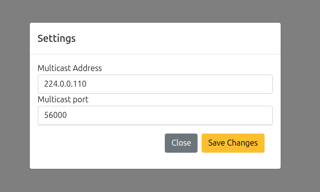
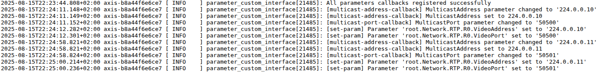
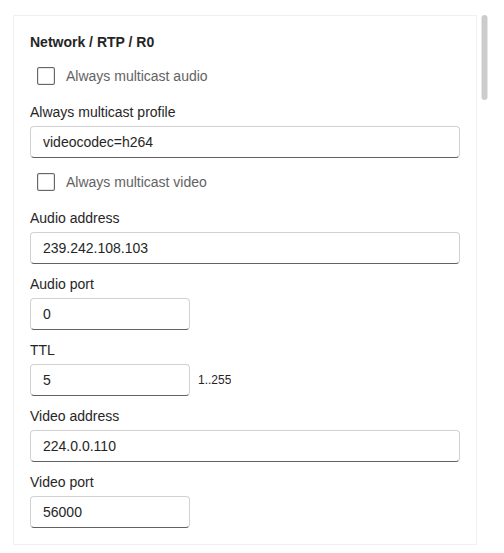

# Test Parameter Custom Interface

Use this guide after building, installing, and starting the `parameter_custom_interface` app.

## What to test

The app should watch the custom settings parameters and write changes to these device system parameters:

- `root.Network.RTP.R0.VideoAddress`
- `root.Network.RTP.R0.VideoPort`

## Test from the app settings page

1. Open `http://192.168.0.90/camera/index.html#/apps`.
2. Select `Parameter custom interface`.
3. Open `Settings`.
4. Change the multicast address or port and save the settings.



5. Check the app logs or open `http://192.168.0.90/axis-cgi/admin/systemlog.cgi?appname=parameter_custom_interface`.
6. Confirm that the log contains the updated multicast value.



## Verify the system parameters

Open Plain Config or use VAPIX to inspect the RTP settings. The values should match the values saved from the app settings page.



List the RTP parameters with VAPIX:

```sh
curl --anyauth -u root:pass "http://192.168.0.90/axis-cgi/param.cgi?action=list&group=root.Network.RTP.R0"
```

Check that `VideoAddress` and `VideoPort` contain the updated values.
