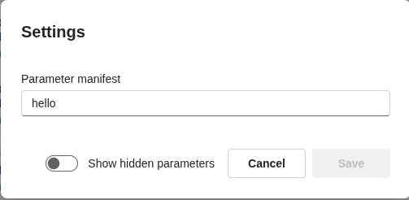
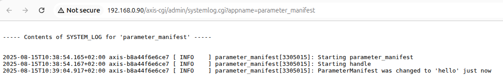

# Test Parameter Manifest

Use this guide after building, installing, and starting the `parameter_manifest` app.

## What to test

The app should watch the `root.parameter_manifest.ParameterManifest` parameter and write a syslog message every time the value changes.

Expected result:

```text
ParameterManifest was changed to '<new value>'
```

## Test from the app settings page

1. Open `http://192.168.0.90/camera/index.html#/apps`.
2. Select `Parameter manifest`.
3. Open `Settings`.
4. Set a string value in the input box, for example `hello`.



5. Check the app logs or open `http://192.168.0.90/axis-cgi/admin/systemlog.cgi?appname=parameter_manifest`.
6. Confirm that the log contains `ParameterManifest was changed to 'hello'`.



## Test with VAPIX

List the app parameters:

```sh
curl --anyauth -u root:pass "http://192.168.0.90/axis-cgi/param.cgi?action=list&group=root.parameter_manifest"
```

Update `ParameterManifest`:

```sh
curl --anyauth -u root:pass "http://192.168.0.90/axis-cgi/param.cgi?action=update&root.parameter_manifest.ParameterManifest=world"
```

Check the logs again. You should see `ParameterManifest was changed to 'world'`.
