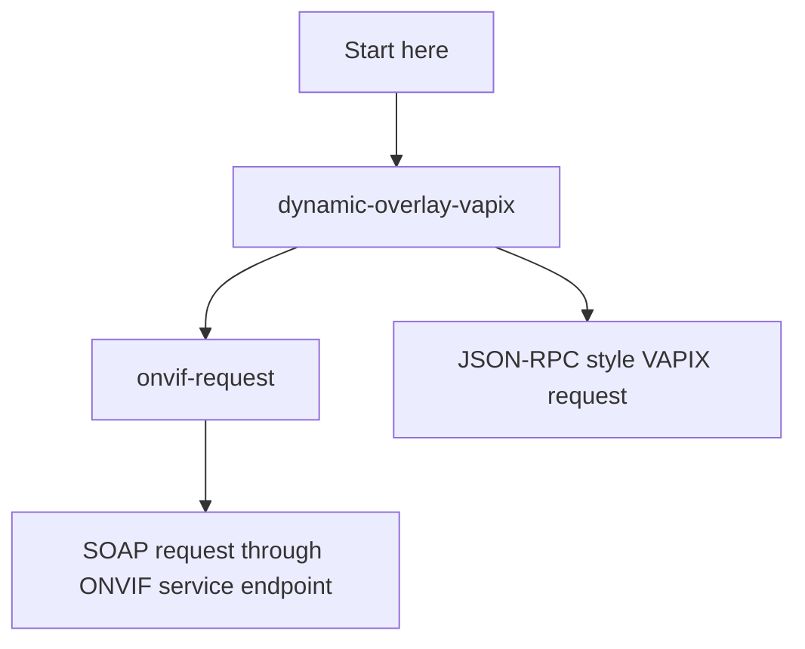
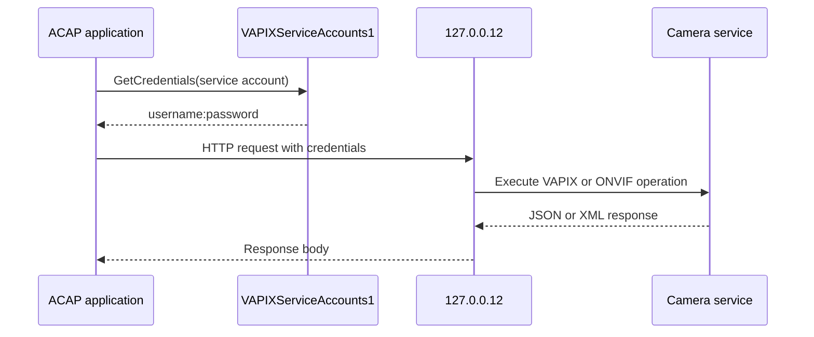

# VAPIX Examples

VAPIX is the HTTP API exposed by Axis devices. In this workshop it belongs to the core/basic track because many ACAP applications eventually need to read or change camera configuration, create overlays, or call camera services from inside the device.

The important lesson is that an ACAP can call the local camera APIs through localhost and use a VAPIX service account instead of embedding a fixed password in the application.

## Learning Order



## Examples

| Example | Main idea | What to study |
| --- | --- | --- |
| `dynamic-overlay-vapix` | Call a local VAPIX endpoint with JSON | Credentials, libcurl, Jansson, response parsing |
| `onvif-request` | Send an ONVIF SOAP request | XML body, authentication, service endpoint, response handling |

## Core Architecture



## Why `127.0.0.12` Is Used

The examples call the camera API from inside the ACAP container:

```c
curl_easy_setopt(handle, CURLOPT_URL, "http://127.0.0.12/axis-cgi/...");
curl_easy_setopt(handle, CURLOPT_NOPROXY, "*");
curl_easy_setopt(handle, CURLOPT_USERPWD, credentials);
```

`127.0.0.12` is the local route to the camera web services from an ACAP application. `CURLOPT_NOPROXY` avoids sending local camera traffic through a proxy configuration.

## Credential Pattern

The examples retrieve credentials through D-Bus:

```c
GVariant *result = g_dbus_connection_call_sync(connection,
                                               "com.axis.HTTPConf1",
                                               "/com/axis/HTTPConf1/VAPIXServiceAccounts1",
                                               "com.axis.HTTPConf1.VAPIXServiceAccounts1",
                                               "GetCredentials",
                                               g_variant_new("(s)", username),
                                               NULL,
                                               G_DBUS_CALL_FLAGS_NONE,
                                               -1,
                                               NULL,
                                               &error);
```

This keeps credentials out of source code. The application asks the camera for credentials for a named service account and then uses those credentials in libcurl.

## Build Pattern

Each example can be built from its own directory:

```sh
docker build --tag example-name --build-arg ARCH=aarch64 .
docker cp $(docker create example-name):/opt/app ./build
```

Install the `.eap` file from `build/` on the camera.

## Teaching Notes

VAPIX is a good early topic because it connects ACAP applications to camera configuration. The student should understand these points before moving to webserver or overlay examples:

- The ACAP process can be both a local client and a service.
- Authentication still matters even when the request is local.
- JSON and XML responses should be parsed with libraries, not string slicing.
- API side effects should be logged clearly because they change camera configuration.
