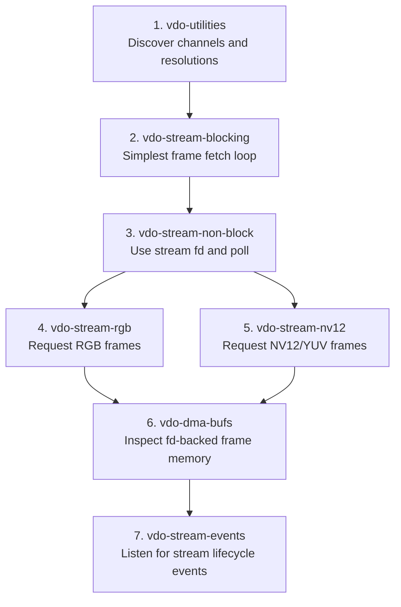
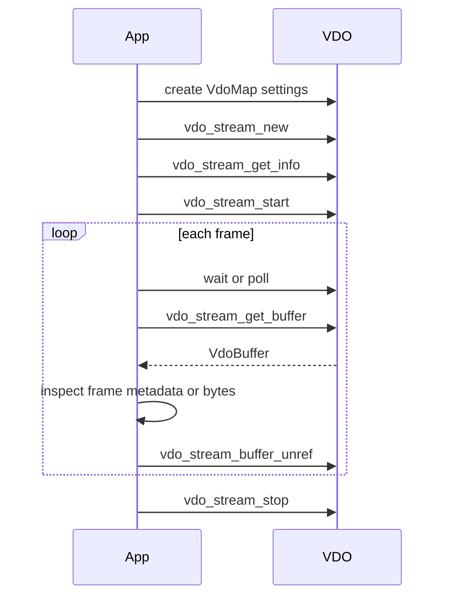
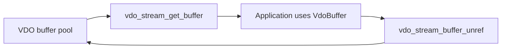
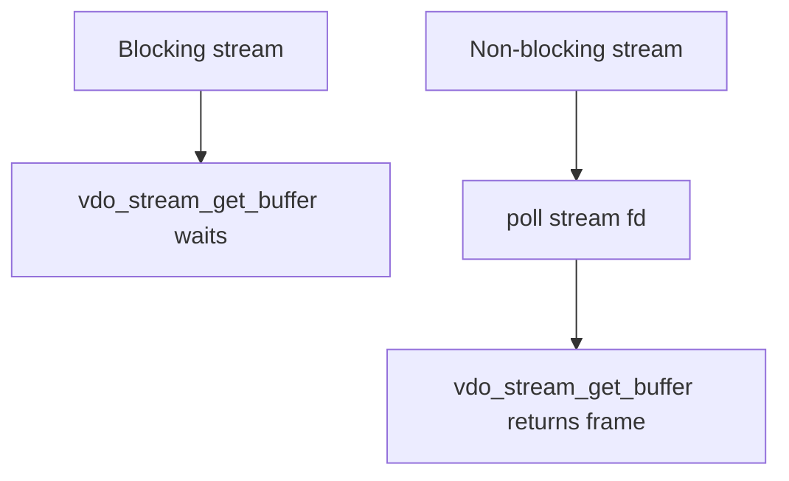
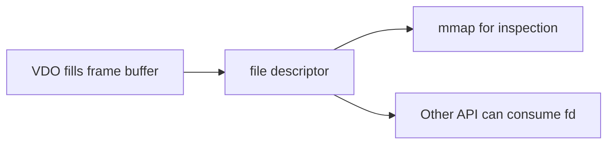

# VDO Examples

This folder is a progressive set of examples for learning VDO, the Axis Video
Data Output API. VDO is the API an ACAP application uses to request frames from
the camera video pipeline.

The examples deliberately do not use larod. They focus only on camera streams,
frame buffers, formats, ownership, polling, and DMA-BUF memory sharing.

## Recommended Learning Order



## Folder Summary

| Folder | Main lesson | Adds |
| --- | --- | --- |
| `vdo-utilities` | Discover camera channels, resolutions, and rotation | channel API, stream info |
| `vdo-stream-blocking` | Fetch frames with the simplest blocking loop | `vdo_stream_get_buffer` ownership |
| `vdo-stream-non-block` | Wait for frames with `poll` | non-blocking stream fd |
| `vdo-stream-rgb` | Request RGB frames | convenience stream API, RGB layout |
| `vdo-stream-nv12` | Request NV12 frames | YUV/NV12 layout |
| `vdo-dma-bufs` | Inspect frame fds and mmap DMA-BUFs | fd, offset, capacity, zero-copy concept |
| `vdo-stream-events` | Listen for VDO stream lifecycle events | pseudo-stream 0, event fd, overlay stream filter |

## What VDO Does

VDO gives an application access to frames from the camera pipeline. The app asks
for a stream with settings such as:

- channel
- format
- resolution
- framerate
- blocking or non-blocking mode
- number of buffers
- image fit behavior

Then VDO returns `VdoBuffer*` objects. Each buffer represents one frame or frame
chunk and must be returned to VDO after use.

## Core Runtime Pattern



## Frame Ownership Rule

The most important VDO rule is:

```text
get buffer -> use buffer -> return buffer
```



Do not read a `VdoBuffer`, `VdoFrame`, or data pointer after returning the
buffer. VDO may immediately reuse that memory for another frame.

## Blocking vs Non-Blocking

Blocking stream:

```text
vdo_stream_get_buffer blocks until a frame is ready
```

Non-blocking stream:

```text
vdo_stream_get_buffer returns immediately
poll(stream_fd) tells you when to try
```



Use blocking mode for the first example. Use non-blocking mode for real
applications that may need timers, sockets, model queues, or several streams in
one event loop.

## Formats

| Format | VDO value | Typical use |
| --- | --- | --- |
| H.264 | `VDO_FORMAT_H264` | encoded stream metadata and compressed bytes |
| RGB | `VDO_FORMAT_RGB` | direct CPU/model-friendly pixels, larger frames |
| YUV/NV12 | `VDO_FORMAT_YUV` or `vdo_stream_nv12_new` | efficient camera/native format |

NV12 layout:

```text
Y plane:  width x height bytes
UV plane: interleaved U,V at half vertical resolution
```

RGB layout:

```text
R G B R G B R G B ...
```

Always read back stream info after creation. VDO may adjust requested settings.

## DMA-BUF Concept

Some VDO buffers are backed by file descriptors. That lets another component map
or share the same memory without copying image bytes.



The VDO DMA-BUF example does not use larod. It only shows that a VDO frame can
be represented by:

- fd
- offset
- capacity
- frame size
- format/pitch from stream info

That is the base concept later used by larod examples.

## Stream Events For Overlay2

`axoverlay2` does not use the old `axoverlay` render callback model. It creates overlays for VDO streams, so an application needs to know when relevant streams exist, appear, and close.

The `vdo-stream-events` example teaches that bridge without using any overlay API:

```mermaid
sequenceDiagram
    participant App
    participant VDO
    participant Loop as GLib main loop

    App->>VDO: vdo_stream_get(0)
    App->>VDO: Attach filter=overlay
    App->>VDO: vdo_stream_get_event_fd()
    App->>Loop: Watch fd
    VDO-->>App: EXISTING, CREATED, CLOSED
    App->>VDO: Read stream info
```

This prepares the student for `overlay2/`, where the next step is to call `axo_create_overlay()` for each relevant stream.

## Teaching Advice

This content is good for newcomers if taught in order:

1. First discover channels and valid resolutions.
2. Then fetch frames with blocking VDO.
3. Then switch to non-blocking `poll`.
4. Then compare RGB and NV12.
5. Inspect DMA-BUF fds and discuss zero-copy memory.
6. Finish with VDO stream events before moving to `overlay2/`.

Avoid starting with DMA-BUF. It is easier after students already understand
buffer ownership and stream lifecycle.

## Suggested Class Exercises

1. Change channel id and observe stream creation behavior.
2. Request unsupported resolution, then inspect the error or readback info.
3. Compare blocking and non-blocking examples.
4. Change RGB to NV12 and compare frame sizes.
5. Log `fd`, `offset`, `capacity`, and `frame_size` in `vdo-dma-bufs`.
6. Capture NV12 to a file and inspect it with `ffplay`.
7. Use `vdo-stream-events` to log stream creation and close events.
