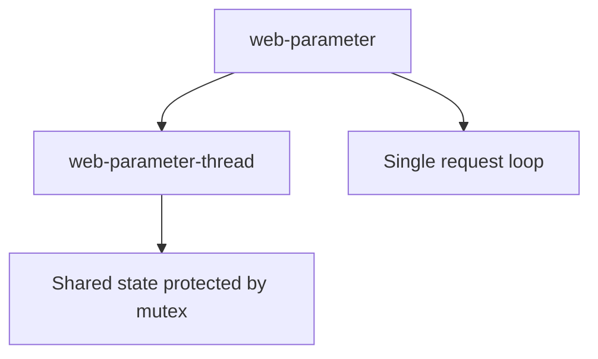
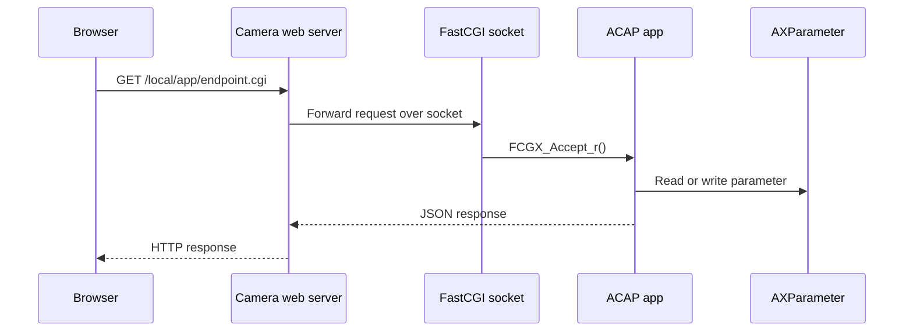
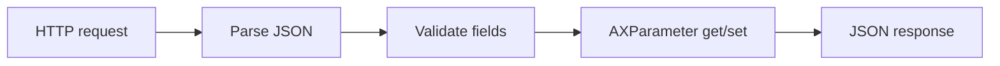

# Webserver FastCGI Examples

These examples show how an ACAP application can expose HTTP endpoints through the camera web server by using FastCGI. This is an intermediate topic because it combines request routing, JSON parsing, AXParameter, and the ACAP package web configuration.

FastCGI is useful when the camera web server should own the public HTTP path and forward requests to the application through a socket.

## Learning Order



## Examples

| Example | Main idea | What to study |
| --- | --- | --- |
| `web-parameter` | Minimal FastCGI JSON API for parameters | `FCGX_Accept_r`, routing by `SCRIPT_NAME`, AXParameter get/set |
| `web-parameter-thread` | Same idea with thread-safe parameter access | Mutexes, idempotent parameter creation, CORS headers |

## Architecture



## FastCGI Request Loop

Both examples use the same core pattern:

```c
sock = FCGX_OpenSocket(socket_path, 5);
FCGX_InitRequest(&req, sock, 0);

while (FCGX_Accept_r(&req) == 0) {
    route_request(&req, handle);
    FCGX_Finish_r(&req);
}
```

The socket path comes from the package runtime environment:

```c
socket_path = getenv("FCGI_SOCKET_NAME");
```

## JSON And Parameters

The examples expose small JSON endpoints that read or update AXParameter values:

```c
ax_parameter_get(handle, "MulticastAddress", &addr, &error);
ax_parameter_set(handle, "MulticastPort", s, FALSE, &error);
```

This is a common pattern for ACAP applications with a small configuration UI.

## Build Pattern

From any example directory:

```sh
docker build --tag example-name --build-arg ARCH=aarch64 .
docker cp $(docker create example-name):/opt/app ./build
```

## Teaching Notes

Use these examples after `parameter/` because the webserver is only a transport layer. The useful mental model is:


