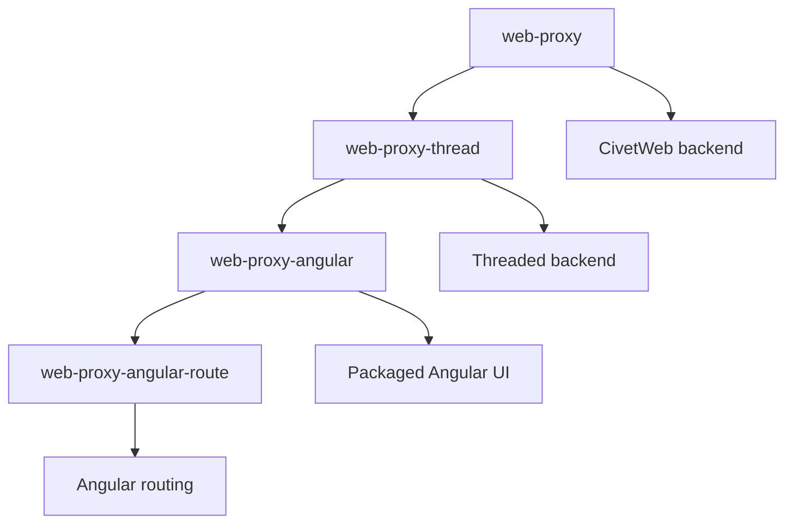
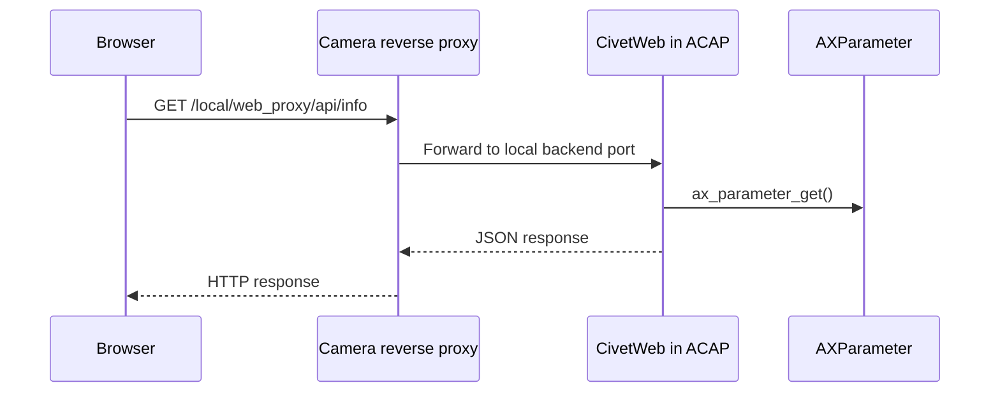

# Webserver Proxy Examples

These examples show a second way to build HTTP APIs in an ACAP application: the app runs its own embedded web server and the camera routes `/local/...` requests to it. The examples use CivetWeb for the backend and Jansson for JSON.

This is an intermediate topic. Study it after `webserver-fastcgi/` so the difference between FastCGI and reverse proxy is clear.

## Learning Order



## Examples

| Example | Main idea | What to study |
| --- | --- | --- |
| `web-proxy` | CivetWeb server with JSON endpoints | Request handlers, JSON parsing, AXParameter |
| `web-proxy-thread` | Threaded CivetWeb server | `num_threads`, mutex-protected parameter access |
| `web-proxy-angular/web-proxy-angular` | ACAP backend with packaged Angular assets | Static UI plus API endpoints |
| `web-proxy-angular/web-proxy-angular-route` | Angular app with client-side routing | Route fallback and packaged frontend |

## Architecture



## CivetWeb Pattern

The backend starts a local server:

```c
const char* opts[] = {
    "listening_ports", PORT,
    "request_timeout_ms", "10000",
    0
};

struct mg_context* ctx = mg_start(&cb, NULL, opts);
```

Handlers are registered by path:

```c
mg_set_request_handler(ctx, "/", RootHandler, NULL);
mg_set_request_handler(ctx, "/local/web_proxy/api/info", InfoHandler, NULL);
mg_set_request_handler(ctx, "/local/web_proxy/api/param", ParamHandler, NULL);
```

## Build Pattern

From an example directory:

```sh
docker build --tag example-name --build-arg ARCH=aarch64 .
docker cp $(docker create example-name):/opt/app ./build
```

For Angular examples, the built frontend files are already copied into `app/html/` in this repository. The Angular source folders show how those assets are produced.

## Teaching Notes

FastCGI and proxy examples solve similar problems but with different ownership:

| Approach | Public HTTP owner | App responsibility |
| --- | --- | --- |
| FastCGI | Camera web server | Answer requests on a FastCGI socket |
| Proxy | Embedded app server plus camera proxy | Serve HTTP directly on a local port |
