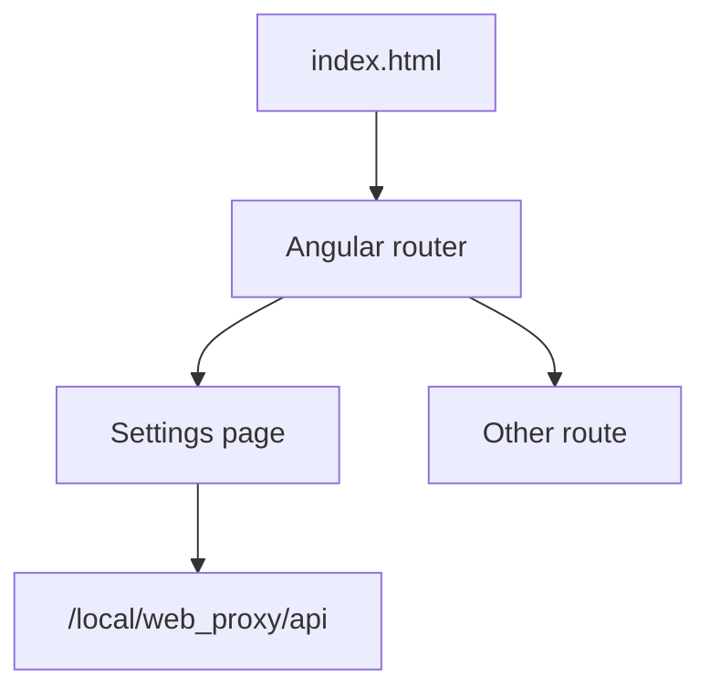

# ACAP Angular UI Routing

This folder contains the Angular source used by `../web-proxy-angular-route/`. It adds client-side routing to the basic Angular UI pattern.

## Concept



The browser route controls which Angular component is displayed. API calls still go to the ACAP backend under `/local/web_proxy/api`.

## API Client

```ts
private readonly BASE = '/local/web_proxy/api';
```

Keep backend API paths stable even when frontend routes change.

## Local Frontend Commands

Before building, confirm `angular.json` uses the routed settings-page base href:

```json
"options": {
    "baseHref": "./index.html",
    "polyfills": ["zone.js"]
}
```

The source `src/index.html` must match:

```html
<base href="./index.html">
```

```sh
npm install
npm run build
```

Copy the build output into `../web-proxy-angular-route/app/html/` before building the ACAP package.

## Classroom Exercises

1. Add another route and verify the API still works.
2. Add an error page for failed API calls.
3. Explain the difference between a browser route and a backend route.
