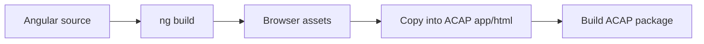

# ACAP Angular UI

This folder contains the Angular source used by `../web-proxy-angular/`. It is not the ACAP package by itself; it is the frontend project that produces static files for the ACAP app.

## Development Flow



## API Client

The UI talks to the ACAP backend through relative camera paths:

```ts
private readonly BASE = '/local/web_proxy/api';

getInfo(): Observable<InfoResponse> {
  return this.http.get<InfoResponse>(`${this.BASE}/info`, {
    headers: { 'Cache-Control': 'no-cache' },
    withCredentials: true,
  });
}
```

Using relative paths lets the same UI work on the camera without hard-coding an IP address.

## Local Frontend Commands

```sh
npm install
npm run build
```

After building, copy the generated browser files into the ACAP example that packages the UI.

## Teaching Notes

The Angular project is useful for showing that an ACAP UI is usually two parts:

- A static frontend compiled ahead of time.
- A C backend that answers JSON requests on the camera.
